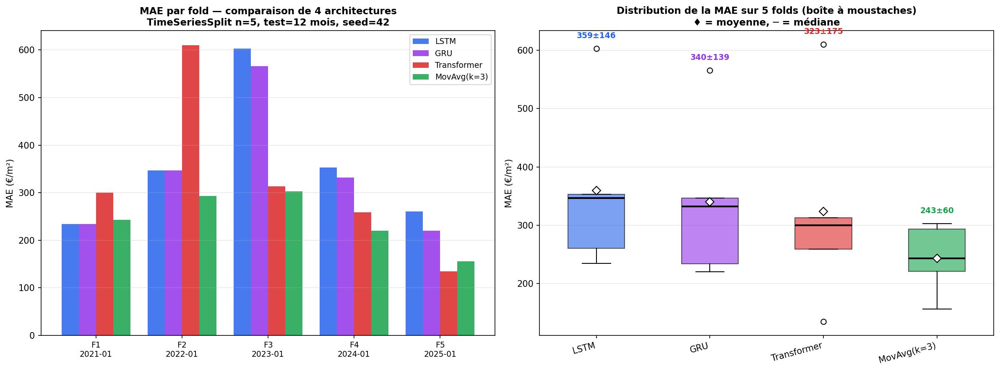
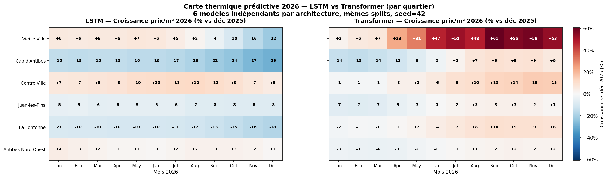
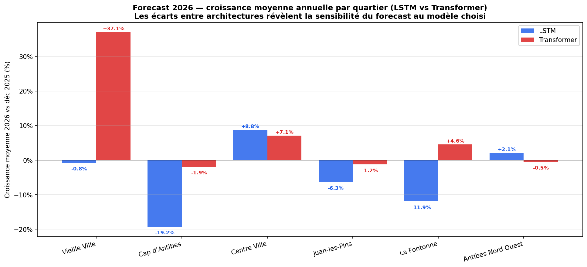

# 🏡 Real Estate Forecasting — Antibes

> Benchmark de **4 architectures** (LSTM, GRU, Transformer, Moyenne Mobile) sur le marché immobilier d'Antibes, sous **cross-validation temporelle** et avec **forecast par quartier 2026**.

---

## 📌 Problème

Sur une série temporelle immobilière courte (~140 mois), **quel apport peut-on attendre du Deep Learning** par rapport à une baseline statistique simple, et comment ce verdict évolue-t-il selon l'architecture choisie ?

À partir des **76 195 transactions DVF brutes** (2014-2025) sur Antibes, on construit une série mensuelle, on benchmarke 4 modèles sous **TimeSeriesSplit 5 folds** glissants, on teste **3 stratégies d'ensemble**, et on décline la modélisation sur les **6 quartiers** pour produire une carte thermique prédictive 2026.

Deux résultats négatifs encadrent la démarche : l'**échec d'une expérimentation macro-économique** (concept drift sur les taux BCE post-2022) et la **persistance de la baseline statistique** en moyenne sur la CV — conformément à Makridakis et al. (2018).

---

## 📂 Données

Pipeline ETL : `merge_dvf.py` → `filter_antibes.py` → `aggregate_monthly.py` → `merge_dvf_geo.py`. Les transactions ponctuelles deviennent une série temporelle mensuelle, complétée d'une dimension spatiale via 6 polygones GeoJSON tracés manuellement sur [geojson.io](https://geojson.io).

| Étape | Volume |
|---|---|
| DVF brutes 2014-2025 | 76 195 transactions |
| Après nettoyage (Antibes, outliers, encodage) | **10 731** |
| Appartements agrégés en mensuel | **144 mois continus** |
| DVF géolocalisées assignées à un quartier | **19 689 (99.9%)** |

| Quartier | Transactions | Prix médian moyen | Croissance 2014→2025 |
|---|---|---|---|
| Vieille Ville | 1 427 | 6 161 €/m² | **+50%** |
| Cap d'Antibes | 2 235 | 5 966 €/m² | +17% |
| Centre Ville | 2 415 | 4 268 €/m² | +37% |
| Juan-les-Pins | 4 935 | 4 339 €/m² | +31% |
| La Fontonne | 2 335 | 4 504 €/m² | +16% |
| Antibes Nord Ouest | 6 330 | 4 296 €/m² | +21% |

**6 features** en entrée des modèles : `prix_m2_median`, `volume`, `surface_median`, `nb_pieces_median`, `mois_sin`, `mois_cos`. Fenêtres glissantes 12 mois, horizon 1 mois, split chronologique 70/15/15. **MinMaxScaler fitté sur le train uniquement**, seed=42.

---

## 🧠 Architectures

Quatre modèles en concurrence, **mêmes hyperparamètres d'entraînement** (Adam lr=1e-3, batch=16, patience=20, epochs ≤ 200, seed=42) pour que les écarts mesurés reflètent l'architecture et non le tuning.

| Modèle | Paramètres | Description |
|---|---|---|
| **LSTM** | 31 137 | LSTM(64) → Dropout(0.2) → LSTM(32) → Dense(16, relu) → Dense(1) |
| **GRU** | 23 777 | Symétrique au LSTM, ~25% de paramètres en moins |
| **Transformer** | 8 801 | d_model=32, MultiHeadAttention(4 heads × 8 dim) + FFN(64), positional encoding sinusoïdal |
| **MovAvg(k=3)** | — | Baseline statistique : moyenne des 3 derniers mois normalisés |

Trois stratégies d'**ensemble** combinent les 4 modèles : moyenne équipondérée, médiane par pas de temps, et **NNLS** (poids non-négatifs appris sur le val set par moindres carrés contraints).

---

## 📊 Résultats clés

### Cross-validation TimeSeriesSplit (5 folds × 12 mois)

Folds glissants couvrant **2021, 2022, 2023, 2024, 2025**, train croissant (84 → 132 mois), scaler refitté par fold (no leakage), modèles ré-entraînés from scratch à chaque fold.

| Modèle | MAE (mean ± std) | RMSE | MAPE |
|---|---|---|---|
| **MovAvg(k=3)** | **243 ± 60 €/m²** | **289 ± 68** | **4.87 ± 1.27%** |
| **Ensemble_median** | **265 ± 82** | 329 ± 98 | 5.1 ± 1.6% |
| Ensemble_mean | 267 ± 81 | 331 ± 99 | 5.2 ± 1.6% |
| Transformer | 323 ± 175 | 379 ± 187 | 6.4 ± 3.6% |
| Ensemble_NNLS | 338 ± 161 | 407 ± 175 | 6.6 ± 3.1% |
| GRU | 340 ± 139 | 396 ± 154 | 6.6 ± 2.5% |
| LSTM | 360 ± 146 | 427 ± 153 | 6.9 ± 2.7% |



**4 enseignements clés** :

1. **L'architecture compte plus que la profondeur** — le Transformer (8.8k params) bat LSTM (31k) et GRU (24k) en MAE moyenne CV : **3.5× moins de paramètres pour de meilleures performances**.
2. **Le Transformer survit au choc BCE 2023** — sur le fold 2023 (hausse BCE 0%→4%), MAE Transformer = 313 €/m² contre 603 pour le LSTM et 566 pour le GRU. L'attention pondère dynamiquement les mois passés ; la récurrence reste prisonnière de la trajectoire récente du train.
3. **Le Transformer bat MovAvg sur le fold 2025** (MAE=135 < 156) — premier modèle deep à dépasser la baseline statistique sur un fold, sur la période où l'historique d'entraînement est le plus long.
4. **Les ensembles dominent tous les modèles deep individuels** — Ensemble_median (265) bat Transformer (323), GRU (340), LSTM (360) ; sur le fold 2025, l'ensemble bat même MovAvg (140 vs 156). Réduction de variance par 2 (std 82 vs 175). MovAvg conserve néanmoins une avance étroite (243 vs 265, +9%) en moyenne — confirmation empirique de Makridakis et al. (2018) sur séries courtes.

### Forecast 2026 par quartier (LSTM vs Transformer)

6 LSTM **et** 6 Transformers indépendants ont été entraînés (un par quartier), avec forecast récursif 12 mois et IC via **Monte Carlo Dropout** (50 inferences).





| Quartier | LSTM | Transformer | Écart |
|---|---|---|---|
| Vieille Ville | −0.8% | **+37.1%** | **+38 pts** |
| Cap d'Antibes | −19.2% | −1.9% | +17 pts |
| La Fontonne | −11.9% | +4.6% | +17 pts |
| Juan-les-Pins | −6.3% | −1.2% | +5 pts |
| Centre Ville | +8.8% | +7.1% | −2 pts |
| Antibes Nord Ouest | +2.1% | −0.5% | −3 pts |

Le Transformer est **systématiquement plus optimiste** que le LSTM sur les quartiers à pic local en fin de série (Cap d'Antibes, Vieille Ville). L'**écart de 38 points** sur Vieille Ville illustre une **incertitude de modélisation** — distincte de l'incertitude de prédiction — qui justifie l'usage d'ensembles plutôt que d'un modèle unique en production.

Les baisses prédites par le LSTM ne reflètent **pas** un signal de marché : elles s'expliquent par (i) la **régression vers la moyenne** d'un modèle MSE quand le dernier point observé est un pic local, (ii) le **drift du forecast récursif** qui injecte les prédictions précédentes dans la fenêtre, et (iii) l'**absence d'ancrage exogène** (cf. limites macro).

**Centre Ville** reste le seul quartier dont la trajectoire haussière est **statistiquement robuste** : LSTM bat baseline (MAE 320 vs 411 €/m²), bandes d'incertitude étroites, prédictions LSTM et Transformer convergentes (+8.8% vs +7.1%).

---

## ⚡ Reproductibilité

```bash
git clone https://github.com/clementmarriere/immo_antibes.git
cd immo_antibes
pip install pandas numpy scikit-learn tensorflow matplotlib geopandas shapely scipy
```

Pipeline complet (ordre d'exécution) :

```bash
# 1. ETL
python src/etl/merge_dvf.py
python src/etl/filter_antibes.py
python src/etl/aggregate_monthly.py
python src/etl/merge_dvf_geo.py

# 2. Features (global + par quartier)
python src/features/build_features.py
python src/features/build_features_geo.py

# 3. Modèles (single test set)
python src/models/lstm.py
python src/models/gru.py
python src/models/transformer.py

# 4. Cross-validation temporelle
python src/models/cv_lstm.py        # LSTM seul, IC sur métriques
python src/models/cv_compare.py     # comparaison 4 architectures
python src/models/cv_ensemble.py    # ensembles mean / median / NNLS

# 5. Modélisation par quartier + forecast 2026
python src/models/lstm_geo.py
python src/models/forecast_geo.py
python src/models/transformer_geo.py
python src/models/forecast_transformer_geo.py

# 6. Score de Dynamique
python src/scoring/score.py

# 7. Visualisations
python src/analysis/eda.py
python src/analysis/plot_results.py
python src/analysis/heatmap.py
python src/analysis/heatmap_forecast.py
python src/analysis/heatmap_forecast_compare.py
```

Toutes les figures sont générées dans `reports/figures/`. Seules **5 figures clés** sont versionnées sur GitHub (11, 14, 15, 16, 17) ; les autres sont regénérées localement.

---

## 📉 Limites

- **Taille du dataset** — 144 mois est à la limite inférieure pour un Deep Learning. Doubler l'échantillon (multi-villes Côte d'Azur) reste l'amélioration la plus impactante.
- **Variables exogènes** — taux BCE / inflation / OAT testés puis abandonnés (concept drift +24σ sur le test post-2022). Un modèle hybride (DL + arbre sur macro avec fusion tardive) serait la suite logique.
- **Forecast récursif** — l'erreur s'accumule à chaque pas. Visible sur Vieille Ville (LSTM) après le mois 8 du forecast 2026. Une architecture **Seq2Seq directe** éviterait cette dérive.
- **Régression vers la moyenne** — limitation structurelle d'un modèle optimisé sur MSE. Le Transformer y est moins sensible mais peut hallucinier dans l'autre direction (Vieille Ville +37%). D'où l'intérêt des ensembles.
- **Type de bien** — appartements uniquement. Pas de maisons ni de locaux commerciaux.

---

## 📁 Sources & références

- **DVF brutes** : [data.gouv.fr](https://www.data.gouv.fr/fr/datasets/demandes-de-valeurs-foncieres/), [data.cquest.org](https://data.cquest.org/dgfip_dvf/)
- **DVF géolocalisées** : [files.data.gouv.fr/geo-dvf](https://files.data.gouv.fr/geo-dvf/latest/csv/)
- **Frameworks** : Keras 3 / TensorFlow 2.x, scikit-learn, scipy
- **Référence académique** : Makridakis, Spiliotis & Assimakopoulos (2018), *Statistical and Machine Learning forecasting methods: Concerns and ways forward*

> Les fichiers DVF bruts ne sont pas inclus dans ce dépôt (taille > 1 Go).

---

## ✍️ Auteurs

Clément Marrière - Dimitri Gardarin

— Projet Deep Learning, 2026
