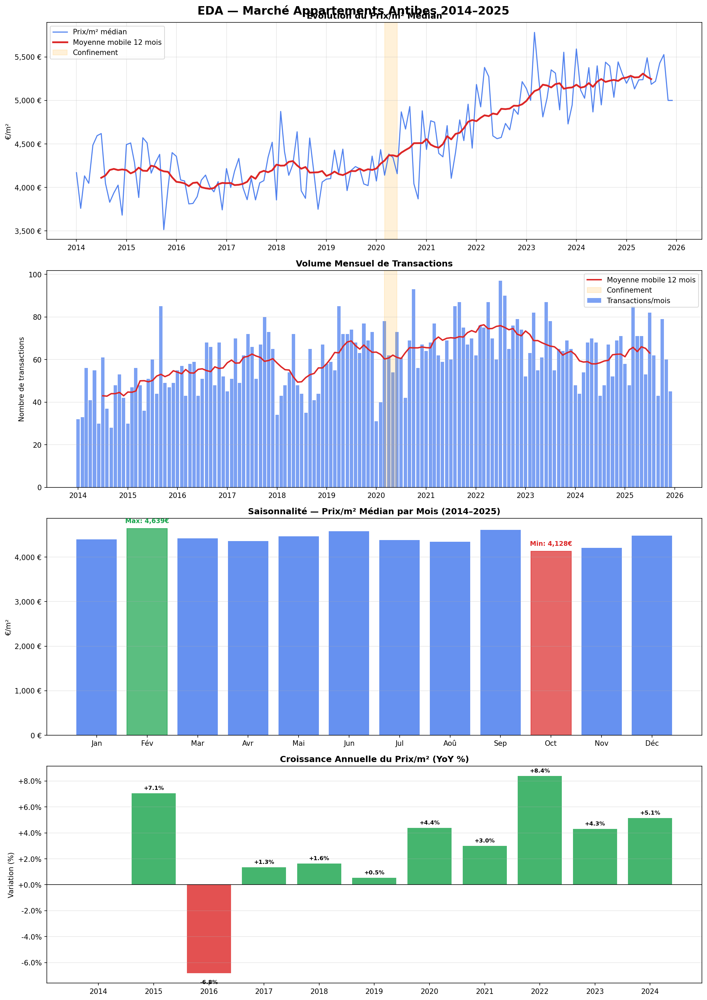
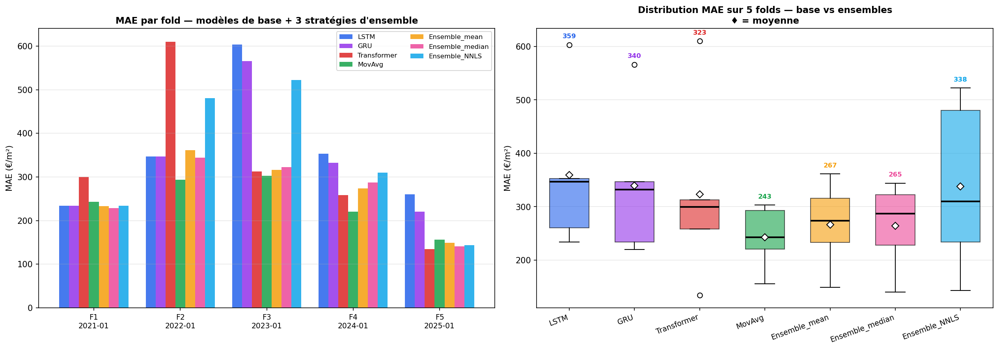
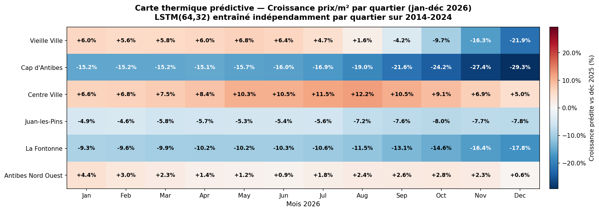

# Real Estate Forecasting — Antibes

> Benchmark of **4 architectures** (LSTM, GRU, Transformer, Moving Average) on the Antibes real estate market, under **temporal cross-validation** with **district-level 2026 forecasts**.

---

## Problem Statement

On a short real estate time series (~140 months), **what can Deep Learning actually contribute** compared to a simple statistical baseline, and how does this verdict shift across architectures?

Starting from **76,195 raw DVF transactions** (2014–2025) in Antibes, we build a monthly series, benchmark 4 models under **TimeSeriesSplit with 5 rolling folds**, test **3 ensemble strategies**, and extend the modelling to **6 districts** to produce a predictive heat map for 2026.

Two negative results frame the work: the **failure of a macro-economic experiment** (concept drift on BCE rates post-2022) and the **persistence of the statistical baseline** on average across CV folds — consistent with Makridakis et al. (2018).

---

## Data

ETL pipeline: `merge_dvf.py` → `filter_antibes.py` → `aggregate_monthly.py` → `merge_dvf_geo.py`. Individual transactions become a monthly time series, extended with a spatial dimension via 6 GeoJSON polygons drawn manually on [geojson.io](https://geojson.io).

| Step | Volume |
|---|---|
| Raw DVF transactions 2014–2025 | 76,195 |
| After cleaning (Antibes, outliers, encoding) | **10,731** |
| Apartments aggregated to monthly | **144 continuous months** |
| Geolocated DVF assigned to a district | **19,689 (99.9%)** |

| District | Transactions | Median price (avg) | Growth 2014→2025 |
|---|---|---|---|
| Vieille Ville | 1,427 | €6,161/m² | **+50%** |
| Cap d'Antibes | 2,235 | €5,966/m² | +17% |
| Centre Ville | 2,415 | €4,268/m² | +37% |
| Juan-les-Pins | 4,935 | €4,339/m² | +31% |
| La Fontonne | 2,335 | €4,504/m² | +16% |
| Antibes Nord Ouest | 6,330 | €4,296/m² | +21% |



**6 input features**: `prix_m2_median`, `volume`, `surface_median`, `nb_pieces_median`, `mois_sin`, `mois_cos`. 12-month sliding windows, 1-month horizon, chronological split 70/15/15. **MinMaxScaler fitted on train only** (no leakage), seed=42.

---

## Architectures

Four models competing on **identical training hyperparameters** (Adam lr=1e-3, batch=16, patience=20, epochs ≤ 200, seed=42) so that measured differences reflect architecture, not tuning.

| Model | Parameters | Description |
|---|---|---|
| **LSTM** | 31,137 | LSTM(64) → Dropout(0.2) → LSTM(32) → Dense(16, relu) → Dense(1) |
| **GRU** | 23,777 | Symmetric to LSTM, ~25% fewer parameters |
| **Transformer** | 8,801 | d_model=32, MultiHeadAttention(4 heads × 8 dim) + FFN(64), sinusoidal positional encoding |
| **MovAvg(k=3)** | — | Statistical baseline: mean of the last 3 normalised months |

Three **ensemble** strategies combine all 4 models: equal-weight mean, per-step median, and **NNLS** (non-negative weights learned on the validation set via constrained least squares).

---

## Key Results

### TimeSeriesSplit cross-validation (5 folds × 12 months)

Rolling folds covering **2021, 2022, 2023, 2024, 2025**, with growing train (84 → 132 months), scaler refitted per fold (no leakage), models retrained from scratch at each fold.

| Model | MAE (mean ± std) | RMSE | MAPE |
|---|---|---|---|
| **MovAvg(k=3)** | **243 ± 60 €/m²** | **289 ± 68** | **4.87 ± 1.27%** |
| **Ensemble_median** | **265 ± 82** | 329 ± 98 | 5.1 ± 1.6% |
| Ensemble_mean | 267 ± 81 | 331 ± 99 | 5.2 ± 1.6% |
| Transformer | 323 ± 175 | 379 ± 187 | 6.4 ± 3.6% |
| Ensemble_NNLS | 338 ± 161 | 407 ± 175 | 6.6 ± 3.1% |
| GRU | 340 ± 139 | 396 ± 154 | 6.6 ± 2.5% |
| LSTM | 360 ± 146 | 427 ± 153 | 6.9 ± 2.7% |




**4 key findings**:

1. **Architecture matters more than depth** — the Transformer (8.8k params) beats both LSTM (31k) and GRU (24k) on mean CV MAE: **3.5× fewer parameters for better performance**.
2. **The Transformer survives the 2023 BCE shock** — on the 2023 fold (BCE rate 0%→4%), Transformer MAE = 313 €/m² vs 603 for LSTM and 566 for GRU. Attention dynamically reweights past months; recurrence stays locked to the recent training trajectory.
3. **The Transformer beats MovAvg on the 2025 fold** (MAE=135 < 156) — first deep model to outperform the statistical baseline on a fold, on the period with the longest training history.
4. **Ensembles dominate all individual deep models** — Ensemble_median (265) beats Transformer (323), GRU (340), LSTM (360); on the 2025 fold, the ensemble also beats MovAvg (140 vs 156). Variance reduced by 2× (std 82 vs 175). MovAvg still holds a narrow overall lead (243 vs 265, +9%) — empirical confirmation of Makridakis et al. (2018) on short series.

### 2026 District Forecast (LSTM vs Transformer)

6 independent LSTMs **and** 6 independent Transformers were trained (one per district), with 12-month recursive forecast and confidence intervals via **Monte Carlo Dropout** (50 inferences).




| District | LSTM | Transformer | Gap |
|---|---|---|---|
| Vieille Ville | −0.8% | **+37.1%** | **+38 pts** |
| Cap d'Antibes | −19.2% | −1.9% | +17 pts |
| La Fontonne | −11.9% | +4.6% | +17 pts |
| Juan-les-Pins | −6.3% | −1.2% | +5 pts |
| Centre Ville | +8.8% | +7.1% | −2 pts |
| Antibes Nord Ouest | +2.1% | −0.5% | −3 pts |

The Transformer is **systematically more optimistic** than LSTM on districts with a local peak at the end of the series (Cap d'Antibes, Vieille Ville). The **38-point gap** on Vieille Ville illustrates **model uncertainty** — distinct from prediction uncertainty — which justifies using ensembles rather than a single model in production.

The LSTM's predicted declines do **not** reflect a market signal: they are explained by (i) **regression to the mean** from an MSE-optimised model when the last observed point is a local peak, (ii) **recursive forecast drift** from injecting previous predictions into the sliding window, and (iii) **absence of exogenous anchoring** (see macro limitations below).

**Centre Ville** is the only district with a statistically robust upward trajectory: LSTM beats baseline (MAE 320 vs 411 €/m²), tight uncertainty bands, converging LSTM and Transformer forecasts (+8.8% vs +7.1%).

---

## Quickstart

```bash
git clone https://github.com/clementmarriere/immo_antibes.git
cd immo_antibes
pip install -r requirements.txt
```

Then run the full pipeline step by step — or all at once:

```bash
make all
```

Individual stages:

```bash
make etl        # raw DVF → monthly time series
make features   # sliding windows + MinMaxScaler
make models     # single train/val/test run per architecture
make cv         # temporal cross-validation (5 folds × 4 models)
make geo        # district models + 2026 forecasts (LSTM + Transformer)
make analysis   # all figures → reports/figures/
```

> Raw DVF files are not included in this repo (>1 GB). Download from [data.gouv.fr](https://www.data.gouv.fr/fr/datasets/demandes-de-valeurs-foncieres/) and [files.data.gouv.fr/geo-dvf](https://files.data.gouv.fr/geo-dvf/latest/csv/), then place them in `data/raw/`.

All figures are generated in `reports/figures/`. Only **6 key figures** are versioned on GitHub (EDA, 11, 14, 15, 16, 17); others are regenerated locally.

---

## Limitations

- **Dataset size** — 144 months is at the lower bound for Deep Learning. Doubling the sample (multi-city Côte d'Azur) remains the highest-impact improvement.
- **Exogenous variables** — BCE rates / inflation / OAT tested then dropped (concept drift +24σ on post-2022 test set). A hybrid model (DL + tree on macro with late fusion) is the logical next step.
- **Recursive forecast** — error accumulates at each step. Visible on Vieille Ville (LSTM) after month 8 of the 2026 forecast. A **direct Seq2Seq** architecture would avoid this drift.
- **Regression to the mean** — structural limitation of an MSE-optimised model. The Transformer is less prone to it but can hallucinate in the opposite direction (Vieille Ville +37%). Hence the value of ensembles.
- **Property type** — apartments only. No houses or commercial premises.

---

## Sources & References

- **Raw DVF**: [data.gouv.fr](https://www.data.gouv.fr/fr/datasets/demandes-de-valeurs-foncieres/), [data.cquest.org](https://data.cquest.org/dgfip_dvf/)
- **Geolocated DVF**: [files.data.gouv.fr/geo-dvf](https://files.data.gouv.fr/geo-dvf/latest/csv/)
- **Frameworks**: Keras 3 / TensorFlow 2.x, scikit-learn, scipy
- **Academic reference**: Makridakis, Spiliotis & Assimakopoulos (2018), *Statistical and Machine Learning forecasting methods: Concerns and ways forward*

> Raw DVF files are not included in this repository (size > 1 GB).

---

## Authors

Clément Marrière · Dimitri Gardarin

Deep Learning Project, 2026
